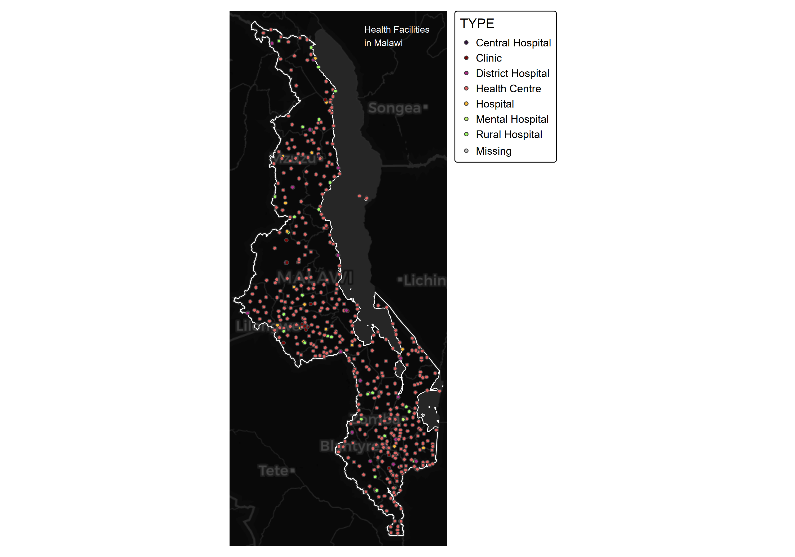
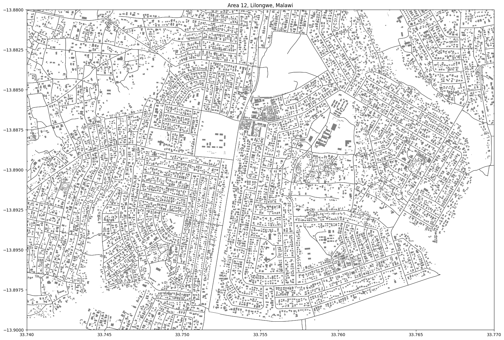
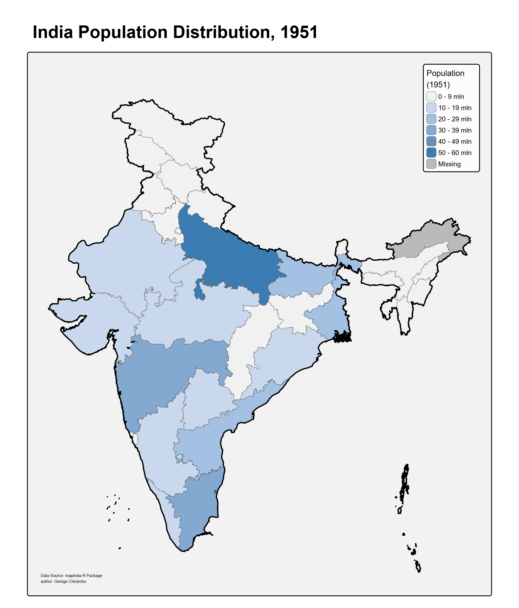
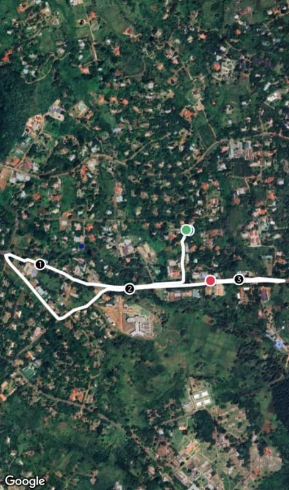

# 30daymapchallenge

DAY 1: POINTS
- map representing health facilities by hospital type in Malawi

 
DAY 2: LINES
- Map of roads and buildings of area 12 in Lilongwe, Malawi. extracted from OSM.

 
DAY 3: POLYGONS
- 1951 India Population distribution by state

 
DAY 4: OWN DATA
- map from my monday morning run 

 
DAY 5: EARTH

 
DAY 6: DIMENSIONS

 
DAY 7: ACCESSIBILITY

 
DAY 8: URBAN

 
DAY 9: ANALOG

 
DAY 10: AIR

 